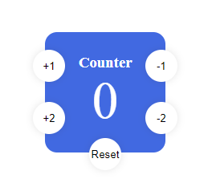

# Counter by Pasquale Cerullo
LIVE - https://linoc00.github.io/counter.github.io/
# Utilizzo
  
Il counter come da immagine è facile da utilizzare poichè molto intuitivo, permette di addizionare un'unità o due, inoltre ha anche la funzionalità di reset che permette di
portare a zero il counter.
